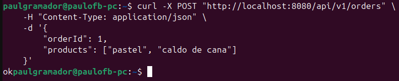
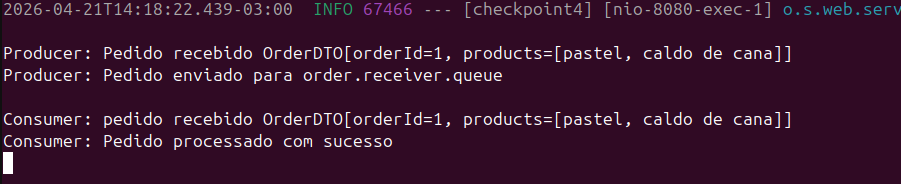
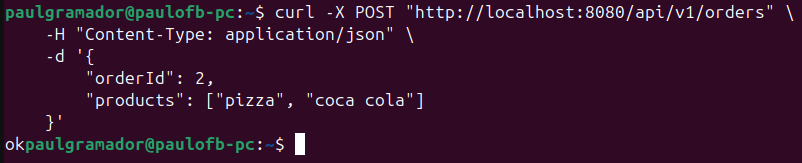
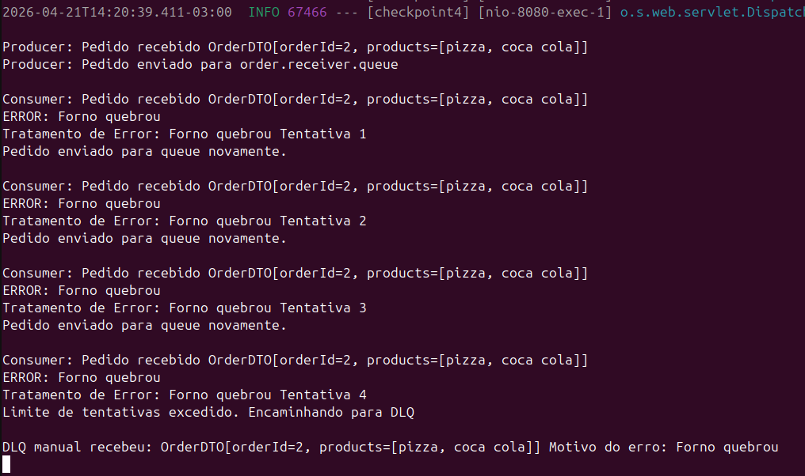
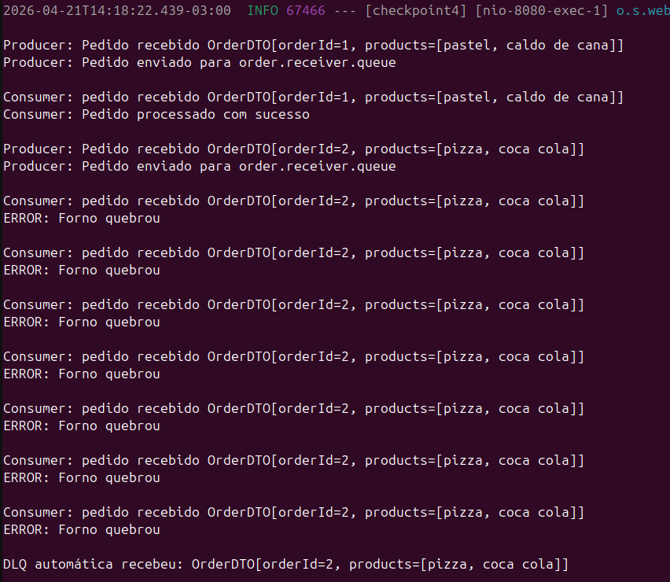
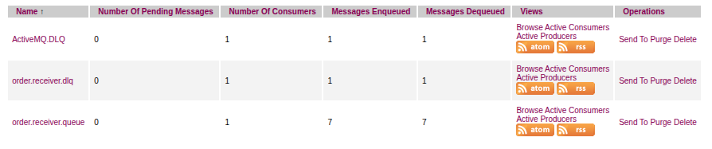

# Checkpoint 04 - Dead Letter Queue com ActiveMQ


---

## Setup do Projeto

Antes de iniciar, certifique-se de ter instalado:

- **Git**
- **Java** (versão 21)
- **Maven** (mvn)
- **Docker**

#### 1. Subir broker ActiveMQ com Docker

```bash
docker run -d --name activemq -p 61616:61616 -p 8161:8161 rmohr/activemq
```

#### 2. Clonar Repositório
```bash
# Clonar o repositório
git clone https://github.com/PauloSergioFB/checkpoint4-java-adv

# Acessar o diretório
cd checkpoint4-java-adv
```

#### 3. Iniciar o projeto

```bash
mvn spring-boot:run
```

Após a inicialização, a API estará disponível em: http://localhost:8080  
Para encontrar o painel administrativo do broker acesse: http://localhost:8161/admin/ (se atente às credencias em ```application.properties```)  
A documentação interativa (Swagger UI) pode ser acessada em: http://localhost:8080/swagger-ui/index.html

## Evidências de Execução

### 1. Cenário de Sucesso

#### 1.1 Requisição Realizada



#### 1.2 Log de Processamento



### 2. Cenário de Sucesso

#### 2.1 Requisição Realizada



#### 2.2 Log de Processamento Quando DLQ Manual



#### 2.3 Log de Processamento Quando DLQ Automática



### 3 Filas no Painel Administrativo do ActiveMQ




## Integrantes do Grupo

RM560485 - [@Cleyton Enrike de Oliveira](https://github.com/Cleytonrik99)  
RM560442 - [@Matheus Freitas](https://github.com/MatheusHenriqueNF)  
RM559914 - [@Paulo Sérgio França Barbosa](https://github.com/PauloSergioFB)  
RM561178 - [@Pedro Henrique Sena](https://github.com/devpedrosena1)  
